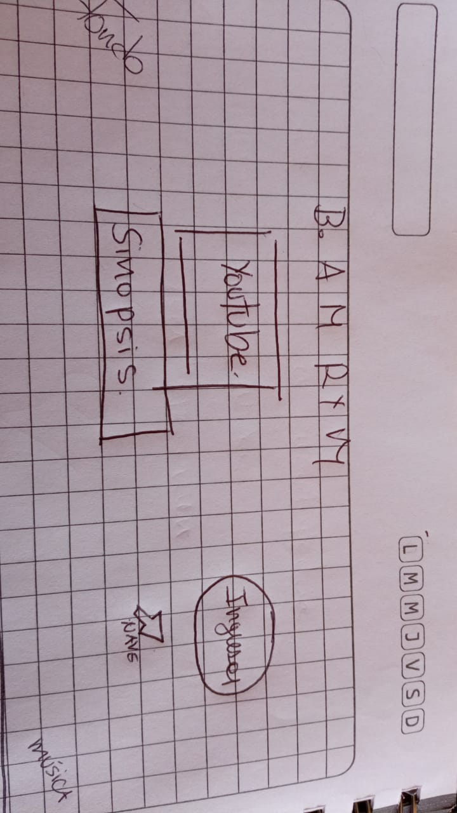

# ENCICLOPEDIA WUBBA LUBBA

## Índice

* [1. Introducción](#1-Introducción)
* [2. Definición del producto](#2-Definición-del-producto)
* [3. Historias de usuarie](#3-Historias-de-usuarie)
* [4. Diseño de la interfaz del usuarie](#4-Diseño-de-la-interfaz-del-usuarie)
* [5. Test de usabilidad](#5-Test-de-usabilidad)
* [6. Link de ENCICLOPEDIA WUBBA LUBBA](#6-Link-de-ENCICLOPEDIA-WUBBA-LUBBA)

***	

## 1.	Introducción
Rick y Morty es una serie de televisión animada estadounidense estrenada el 2014. Sigue la historia de Rick Sánchez, la definición exacta de "científico loco" quien se muda a la casa de su hija, Beth y decide obligar a su nieto, Morty, a que lo acompañe a sus alocadas y peligrosas aventuras por el espacio y diferentes dimensiones.
## 2.	Definición del producto
Esta es una App creada no solo para fanáticos, sino que también para gente que disfruta ver de la serie en sus tiempos libres, pero no necesariamente conoce todo sobre ella. En base a eso, en la página principal se pueden encontrar unos links que te derivan a un tráiler y a una sinopsis con información sobre la serie. Además, está el botón para ingresar a la segunda página, la que despliega cartas con las imágenes y nombres de los personajes, y a su vez, al darse vuelta revela más información sobre cada uno. 
En la segunda página le usuarie puede ordenar a los personajes alfabéticamente de la A a la Z y de la Z a la A. También puede filtrar a los personajes por especie y estado. Y finalmente, puede limpiar las casillas de filtros con un botón “limpiar” y puede regresar a la página principal con un botón “volver”.
## 3.	Historias de usuarie

## 4.	Diseño de la interfaz del usuarie

### a.	Prototipo de baja fidelidad

### b.	Prototipo de alta fidelidad

Tamaño Desktop

Tamaño Celular

## 5.	Test de usabilidad
Cuando hicimos los test de usabilidad, el principal problema que detectamos fueron las imágenes de fondo que utilizábamos en el fondo de la segunda página y en el fondo de las cartas, ya que los colores eran demasiado sobrecargados y no permitían apreciar bien otros elementos como las letras, por ejemplo. Para solucionar estos problemas, cambiamos la imagen de fondo de la segunda página por una más neutral y le pusimos una transparencia a la carta para que, a la hora de voltearse, se vieran mejor las letras.
## 6.	Link de ENCICLOPEDIA WUBBA LUBBA